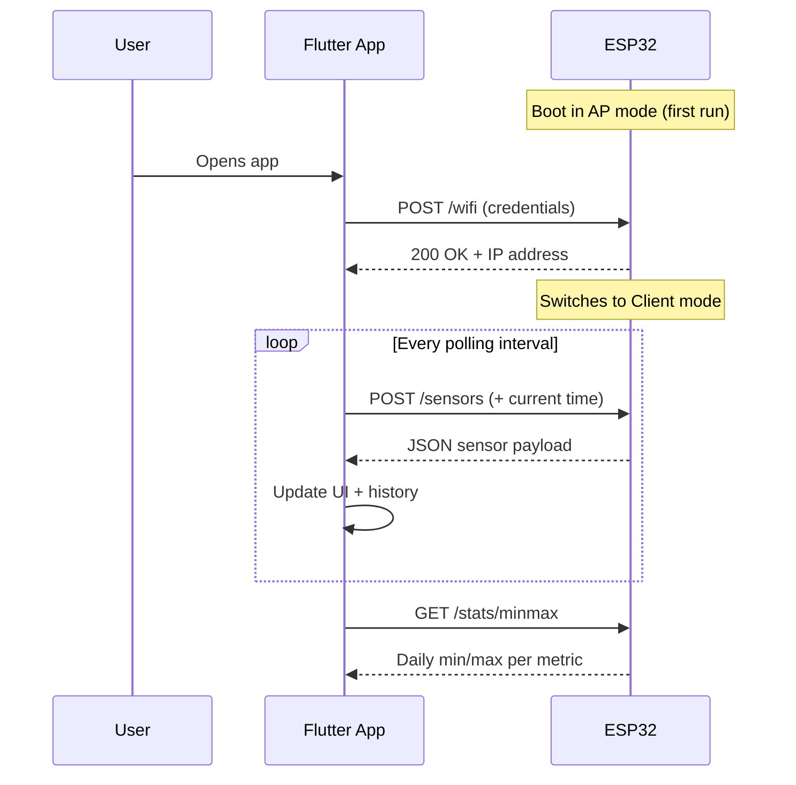
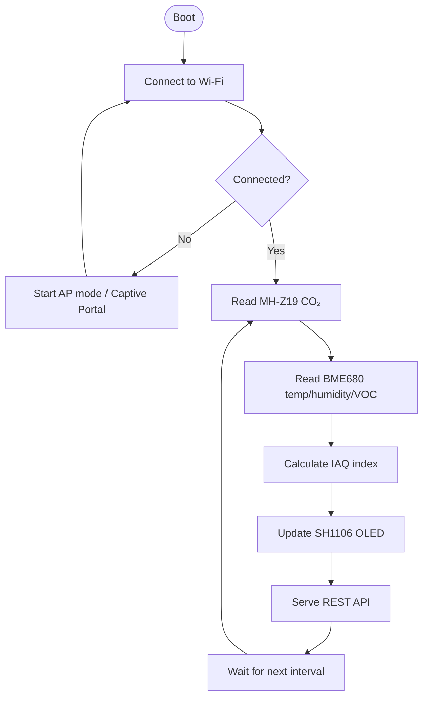

# Aethris — Air Quality Monitor

> IoT system for continuous indoor air quality monitoring with a Flutter mobile app and ESP32 firmware.

[](LICENSE)
[](https://micropython.org/)
[](https://flutter.dev/)
[](https://www.espressif.com/)

---

## What is Aethris?

People spend up to **90% of their time indoors**, yet most have no objective data about the air they breathe. Elevated CO₂, volatile organic compounds (VOC), poor humidity, and temperature all measurably reduce focus, sleep quality, and productivity — usually without users ever realising the cause.

Aethris solves this by combining an ESP32-based hardware sensor node with a Flutter mobile app that delivers real-time measurements, historical min/max tracking, and personalised recommendations based on the current activity mode (work, study, sleep).

---

## Hardware Overview

| Component | Role |
|-----------|------|
| **ESP32 DevKit 3** | Main MCU — data collection, REST API, Wi-Fi |
| **MH-Z19 (NDIR)** | CO₂ measurement via UART — accuracy ±50 ppm + 5% |
| **BME680** | Temperature, humidity, pressure, VOC via I²C |
| **SH1106 OLED** | Local display of live readings |

### Why NDIR over eCO₂?

```
Accuracy comparison (typical):

eCO₂ sensors   ████████████████████░░░░░░░░░░   ~15–30% error
MH-Z19 NDIR    ████░░░░░░░░░░░░░░░░░░░░░░░░░░   ±50 ppm + 5%

Result: Aethris measurements are 60–80% more reliable.
```

---

## Sensor Data

The ESP32 exposes a REST API. Each reading returns:

```json
{
  "temperature":   23.45,
  "humidity":      45.2,
  "pressure":      1013.25,
  "gas_resistance": 154200,
  "co2":           850,
  "timestamp":     1711631200
}
```

| Field | Unit | Description |
|-------|------|-------------|
| `temperature` | °C | Ambient temperature (BME680) |
| `humidity` | % | Relative air humidity |
| `pressure` | hPa | Atmospheric pressure |
| `gas_resistance` | Ω | VOC proxy — higher = cleaner air |
| `co2` | ppm | CO₂ concentration (MH-Z19) |
| `timestamp` | UNIX | UTC epoch for history sync |

### CO₂ Quality Thresholds

```
< 600 ppm   ██████████████████████████   Excellent
  600–1000  ████████████████░░░░░░░░░░   Good
 1000–1500  ████████░░░░░░░░░░░░░░░░░░   Fair — consider ventilating
 > 1500     ████░░░░░░░░░░░░░░░░░░░░░░   Poor — ventilate now
```

---

## System Architecture

### Network Flow



### Firmware Loop



### Mobile App Architecture

```
app/
├── models/        # Data structures — readings, device state
├── services/      # HTTP client, ESP32 communication
├── screens/       # Onboarding · Dashboard · Settings
└── widgets/       # Reusable UI components
```

---

## API Endpoints

| Endpoint | Method | Description |
|----------|--------|-------------|
| `/ping` | GET | Health check — is device reachable? |
| `/sensors` | POST | Read sensors + sync display time |
| `/stats/minmax` | GET | Historical min/max per metric |
| `/stats/minmax` | POST | Reset stored min/max |
| `/health` | GET | Firmware version, Wi-Fi info, AP status |
| `/wifi` | POST | Send Wi-Fi credentials during onboarding |
| `/wifi/status` | GET | Current Wi-Fi connection details (IP, SSID) |

---

## Development Methodology

The project was built solo using an **adapted Scrum** process — the author acted as Product Owner, Scrum Master, and Developer simultaneously.

```
Sprint 1   Requirements & UX design
Sprint 2   Hardware prototyping
Sprint 3   Firmware + REST API
Sprint 4   Flutter app + onboarding 
Sprint 5   Integration & testing
```

---

## Test Scenarios

| Scenario | Result |
|----------|--------|
| Onboarding via AP / Captive Portal | ✅ IP obtained in < 15 s |
| CO₂ detection (breath test) | ✅ 1800 ppm detected in < 5 s |
| VOC detection (alcohol test) | ✅ Spike detected in < 3 s |
| Timeout — device power loss | ✅ App enters offline mode gracefully |
| Wi-Fi reconnection after outage | ✅ Reconnected within 10 s |
| Time sync via `/sensors` | ✅ OLED time matches phone time |

---

## Deployment

### Firmware (ESP32)

```bash
# 1. Flash MicroPython
esptool.py --chip esp32 erase_flash
esptool.py --chip esp32 write_flash -z 0x1000 micropython.bin

# 2. Upload project files via Thonny IDE
#    Copy all files from /ESP to the root of the device

# 3. Restart — boot.py and main.py run automatically
```

### Mobile App

```bash
# Get dependencies
flutter pub get

# Android
flutter build apk --release

# iOS (requires macOS + Xcode)
flutter build ios --release
```

---

## Economics

| | Cost |
|---|---|
| Total hardware | **2 746 CZK** |
| Comparable commercial NDIR system | 4 500–6 000 CZK |
| **Savings** | **~40–55%** |

A 10% daily productivity gain from timely ventilation (≈ 45 min/day) means the hardware investment pays back within **one month** of active use.

---

## Repository

[github.com/Simon-J-Hloska/Aethris--Air-Quality-Monitor](https://github.com/Simon-J-Hloska/Aethris--Air-Quality-Monitor)

---

## License

Copyright 2026 Šimon J. Hloska — MIT License. See [LICENSE](LICENSE) for full terms.
